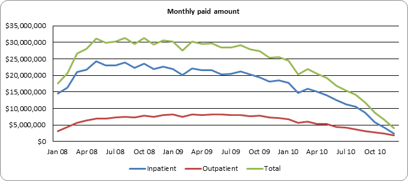
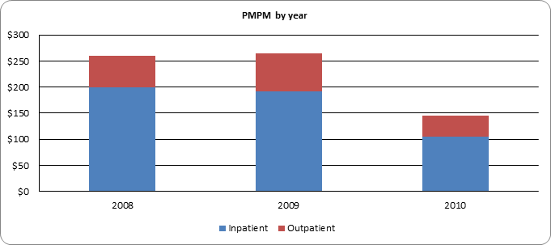
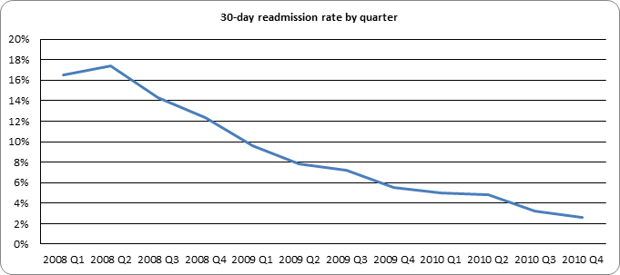

# Claims KPI Reporting Pipeline

An end-to-end healthcare claims reporting pipeline: raw CMS Medicare claims files → SQL Server staging → cleaned reporting tables → KPI views → a spreadsheet report with charts and a one-click VBA refresh and PDF export.

**Stack:** SQL Server 2025 Express · T-SQL · Python (pyodbc, openpyxl) for loading · Excel / Google Sheets · VBA

## Purpose

This project shows the day-to-day work of an IT / data analyst on a benefits or claims team:

- loading messy source files reliably and reconciling row counts,
- turning raw multi-row claims into a clean, typed reporting model,
- finding, counting and documenting data quality problems, and making explicit decisions about each,
- defining standard KPIs (PMPM, length of stay, readmission rate) in SQL views that a report consumes,
- delivering a refreshable report to non-technical stakeholders.

## Data source

**CMS 2008–2010 Data Entrepreneurs' Synthetic Public Use File (DE-SynPUF), Sample 1**
<https://www.cms.gov/data-research/statistics-trends-and-reports/medicare-claims-synthetic-public-use-files/cms-2008-2010-data-entrepreneurs-synthetic-public-use-file-de-synpuf/de10-sample-1>

The DE-SynPUF is **fully synthetic** Medicare data: it has the structure of real CMS claims, but no record belongs to a real person. Files used:

| File | Rows | Staging table |
|---|---:|---|
| Beneficiary Summary 2008 | 116,352 | `stg_beneficiary_2008` |
| Beneficiary Summary 2009 | 114,538 | `stg_beneficiary_2009` |
| Beneficiary Summary 2010 | 112,754 | `stg_beneficiary_2010` |
| Inpatient Claims 2008–2010 | 66,773 | `stg_inpatient` |
| Outpatient Claims 2008–2010 | 790,790 | `stg_outpatient` |

Note: on cms.gov, the Sample 1 *2010 Beneficiary* link downloads a zip named `..._sample_20.zip`. Its contents were verified to be Sample 1 (see [data quality findings](docs/data_quality_findings.md#issues-found-and-how-each-was-handled), #1).

## Project structure

```
ClaimsProject/
├── sql/claims_kpi_project.sql     schema, load + clean, data quality checks, KPI views
├── scripts/load_staging.py        CSV -> staging tables (all NVARCHAR(50))
├── scripts/build_report.py        KPI views -> ClaimsKPI_Report.xlsx (sheets + Summary charts)
├── scripts/build_excel_report.ps1 .xlsx -> ClaimsKPI_Report.xlsm (live SQL queries + button)
├── vba/RefreshReport.bas          Excel macro: refresh all queries, timestamp, export PDF
├── ClaimsKPI_Report.xlsm          Excel report: live SQL Server queries, VBA refresh + PDF
├── ClaimsKPI_Report.xlsx          snapshot version (for Google Sheets)
├── docs/
│   ├── data_quality_findings.md   what was found, how many records, how it was handled
│   ├── excel_report_setup.md      Google Sheets upload, and click-by-click Excel + VBA setup
│   └── interview_walkthrough.md   plain-language explanation of the pipeline and decisions
├── screenshots/                   chart images exported from the Summary sheet
└── data/                          raw downloads (git-ignored, never committed)
```

## Pipeline

```
CMS CSVs ──load_staging.py──► stg_* tables ──section 2 (T-SQL)──► member / member_coverage / claim
  (raw, all text)              (raw, all NVARCHAR(50))              (typed, cleaned, 1 row per claim)
                                                                         │
                                         section 3: data quality checks ◄┤
                                                                         ▼
                                                             section 4: KPI views
                                                                         │
                                       build_report.py / Excel queries ◄─┘
                                                     │
                                  Summary sheet + charts ──RefreshAndExport (VBA)──► dated PDF
```

## Data model

| Table | Grain | Key | Built from |
|---|---|---|---|
| `dbo.member` | one row per person | `member_id` | Beneficiary files; demographics taken from the person's **latest** year on file |
| `dbo.member_coverage` | one row per person per year | `member_id, coverage_year` | `BENE_HI_CVRAGE_TOT_MONS` (Part A coverage months) from each year's file |
| `dbo.claim` | one row per claim | `claim_id, claim_type` | Inpatient (`IP`) and outpatient (`OP`) claims, with **segments merged** |

`claim.member_id` is a foreign key to `member`, and `member_coverage.member_id` is a foreign key to `member`. Indexes on `(member_id, from_date)` and `(claim_type, from_date)` support the per-member window functions and the time-based views.

**Cleaning rules (section 2):**
- Dates are converted from `yyyymmdd` text with `TRY_CONVERT(date, x, 112)`, and amounts with `TRY_CAST(x AS decimal(12,2))`. Bad values become NULL instead of failing the load, and section 3 counts them.
- Sex code `1/2` → `M/F`.
- **Segments:** a long claim arrives as several rows (segment 1, 2). They are collapsed to one row per claim. Dates come from segment 1 (segment 2 rows have none), paid amounts are summed across segments, and provider and diagnosis come from segment 1, the claim header.

## KPI definitions

All KPIs are views in section 4 of `sql/claims_kpi_project.sql`. Time-trend views cover the 2008–2010 coverage window.

| KPI | Definition | View |
|---|---|---|
| **Claim volume** | Number of claims (after merging segments), by week or month and claim type | `v_kpi_weekly`, `v_kpi_monthly` |
| **Members with claims** | Distinct members with at least one claim in the period | `v_kpi_weekly`, `v_kpi_monthly` |
| **Total paid** | Sum of Medicare paid amount (`CLM_PMT_AMT`, all segments), including negative adjustments | all |
| **Average paid per claim** | Total paid ÷ claim count (zero-paid claims included) | `v_kpi_weekly`, `v_kpi_monthly` |
| **PMPM (per member per month)** | Total paid in the year ÷ total member-months of coverage in the year. Member-months = sum of each member's Part A coverage months. This is the standard cost KPI in benefits: it normalises spend for membership size and partial-year enrolment. | `v_kpi_annual_pmpm` |
| **Admissions** | Number of inpatient stays (one merged IP claim = one stay), by admission quarter | `v_kpi_inpatient_quarterly` |
| **Length of stay (LOS)** | Days from admission to discharge, `DATEDIFF(day, admit, discharge)`. A same-day stay = 0. Admission date falls back to claim from-date, and discharge date to claim thru-date. | `v_inpatient_stays` |
| **Average length of stay (ALOS)** | Mean LOS over stays admitted in the period | `v_kpi_inpatient_quarterly` |
| **30-day readmission rate** | Share of inpatient stays (index stays) followed by **another** admission for the same member that starts on or after the discharge date and no more than 30 days after it. Computed with `LEAD(admit_dt) OVER (PARTITION BY member_id ORDER BY admit_dt)`. Reported by the quarter of the index stay's admission. | `v_inpatient_stays`, `v_kpi_inpatient_quarterly` |
| **Paid by diagnosis** | Claim count and total paid by primary ICD-9 diagnosis (segment-1 value) and claim type | `v_paid_by_diagnosis` |

## Headline results (2008–2010)

| Metric | Value |
|---|---:|
| Claims (after merging segments) | 846,520 (66,705 IP + 779,815 OP) |
| Total paid, IP + OP (claims dated 2008–2010) | $860,278,540 |
| Overall PMPM (IP + OP) | $223.77 |
| PMPM by year (IP + OP) | 2008: $259.49 · 2009: $264.23 · 2010: $145.88 |
| Inpatient admissions | 66,479 |
| Average length of stay | 5.69 days |
| 30-day readmission rate | 10.0% (16.5% in 2008 Q1 → 2.6% in 2010 Q4) |







**Interpretation caveat:** the drop in 2010 is a property of the synthetic file, not a real trend. Inpatient admissions per 1,000 member-years fall from 256 to 129 while membership falls only 3%. See [data quality findings](docs/data_quality_findings.md#analytic-caveats-not-errors-but-they-affect-interpretation).

## Data quality findings (summary)

Full write-up: [docs/data_quality_findings.md](docs/data_quality_findings.md). **10 issues** needed a handling decision:

| Issue | Records | Handling |
|---|---:|---|
| 2010 beneficiary file mislabeled as Sample 20 on cms.gov | 1 file | Verified as Sample 1 (100% member overlap) |
| Claims split into segments | 11,043 claims | Merged; paid summed; header values from segment 1 |
| Segment-2-only claims (no dates) | 278 | Kept; excluded from date-based KPIs |
| Segments disagree on diagnosis / provider | 5,543 / 7,703 | Use segment 1 (claim header) |
| Negative paid | 2,612 (−$113,570) | Kept, as adjustments |
| Zero paid | 31,868 | Kept, as utilisation with no payment |
| Missing primary diagnosis | 215 | Excluded from diagnosis view only |
| Claims dated in 2007 | 536 | Excluded from trend views and PMPM |
| Claims for members with 0 coverage months that year | 5,310 | Kept; noted as a PMPM limitation |
| Overlapping inpatient stays | 1,810 | Not counted as readmissions |

Clean checks (zero problems found): unparseable dates and amounts, thru-date before from-date, missing paid, missing admission date, duplicate claims or members, orphan members, missing demographics.

## How to rebuild from scratch

Prerequisites (Windows): SQL Server Express (`localhost\SQLEXPRESS`), SSMS, ODBC Driver 18 for SQL Server, Python 3.9+, and optionally sqlcmd.

```powershell
winget install --id Microsoft.SQLServer.2025.Express -e
winget install --id Microsoft.SQLServerManagementStudio -e
winget install --id Microsoft.msodbcsql.18 -e
winget install --id Microsoft.Sqlcmd -e
py -m pip install pyodbc openpyxl
```

1. **Download data.** From the [Sample 1 page](https://www.cms.gov/data-research/statistics-trends-and-reports/medicare-claims-synthetic-public-use-files/cms-2008-2010-data-entrepreneurs-synthetic-public-use-file-de-synpuf/de10-sample-1), download the 2008, 2009 and 2010 Beneficiary Summary files and the Inpatient and Outpatient Claims. Unzip all five CSVs into `data/raw/`.
2. **Load staging.** This creates the `ClaimsKPI` database and the 5 `stg_*` tables, and prints a row-count reconciliation:
   ```powershell
   py scripts/load_staging.py
   ```
3. **Build, clean and create views.** Open `sql/claims_kpi_project.sql` in SSMS (server `localhost\SQLEXPRESS`, Windows Authentication) and run it section by section, or all at once:
   ```powershell
   sqlcmd -S "np:\\.\pipe\MSSQL$SQLEXPRESS\sql\query" -E -C -b -i sql\claims_kpi_project.sql
   ```
   (The explicit named-pipe address avoids a known issue where the Go-based `sqlcmd` times out resolving `localhost\SQLEXPRESS`. SSMS and ODBC connect with `localhost\SQLEXPRESS` normally.) The script is re-runnable: it drops and recreates everything except the staging tables.
4. **Build the report.** The first command makes the snapshot `.xlsx`. The second turns it into the Excel version with live queries (needs Excel).
   ```powershell
   py scripts/build_report.py
   powershell -ExecutionPolicy Bypass -File scriptsuild_excel_report.ps1
   ```
5. **Import the macro once** (Alt+F11 → File → Import File → `vba\RefreshReport.bas` → save). After that, the **Refresh & Export PDF** button on Summary refreshes everything from SQL Server and saves a dated PDF. Details, and the Google Sheets route: [docs/excel_report_setup.md](docs/excel_report_setup.md).

Total runtime: about 3 minutes (most of it loading 790k outpatient rows).
